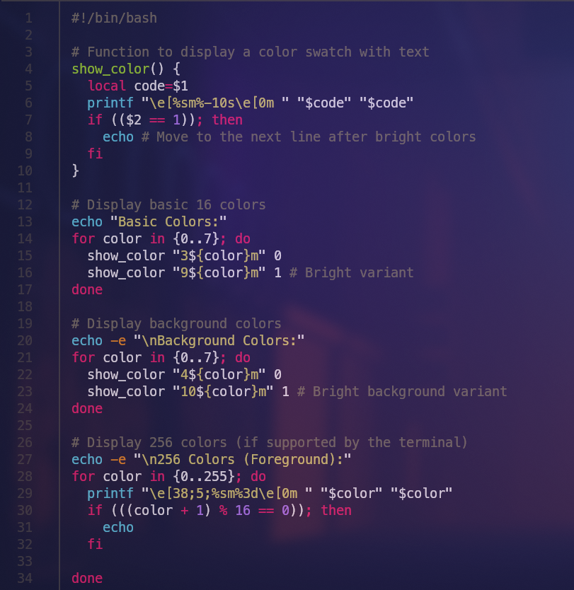
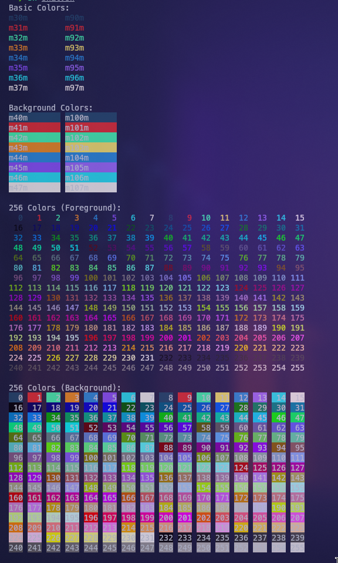
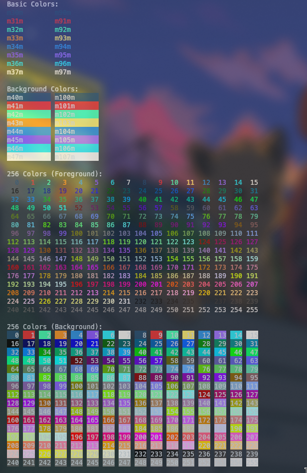
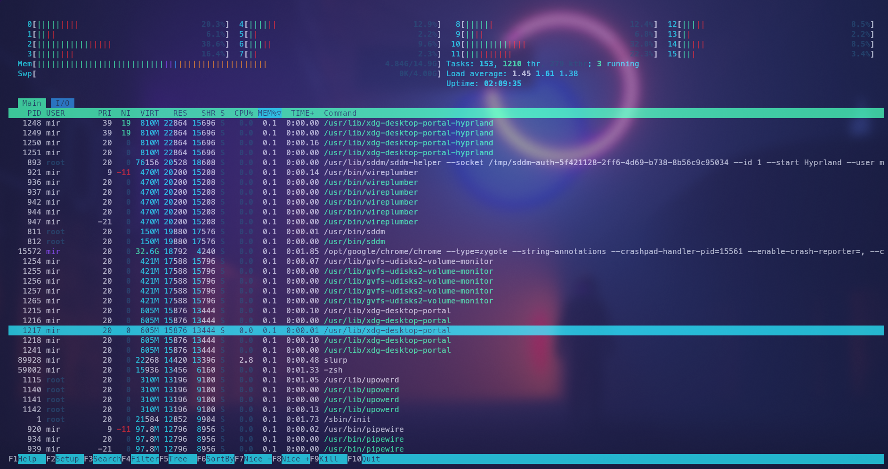

# Dainty-Dark theme for Kitty

A sleek and modern color theme for the Kitty terminal inspired by minimalism and dark aesthetics. Perfect for users who prefer a clean, high-contrast interface with subtle accents.

## Preview






> **Note**: The appearance might vary slightly depending on your display and the background transparency settings.

## Installation

To use this theme in your Kitty terminal, follow these steps:

1. **Download the Theme**:

   - You can download the theme directly from this repository:
     ```bash
     git clone https://github.com/Anshul-exe/Dainty-Dark_kitty_theme.git
     ```

2. **Add the Theme to Kitty**:

   - Add the following line to your `kitty.conf` file:
     ```bash
     include /path/to/daintyDark.conf
     ```
   - Replace `/path/to/daintyDark.conf` with the actual path to the theme file.

3. **Apply the Theme**:
   - You can use the `kitty @ set-colors` command to apply the theme immediately:
     ```bash
     kitty @ set-colors --all /path/to/daintyDark.conf
     ```

## License

This theme is licensed under the MIT License. See the [LICENSE](./LICENSE) file for more information.

## Customization

Feel free to modify this theme to fit your personal preferences. You can change individual color settings by editing the `daintyDark.conf` file.

## Contributing

If you would like to contribute improvements or other features to this theme, please fork the repository and submit a pull request. Make sure to include a description of the changes and test your modifications.

## Acknowledgements

- Thanks to the Kitty terminal team for creating such a powerful and customizable terminal.
